# [202127086-노민종] ICC 제어기 설계 보고서

**과목**: 자동제어 — 2026 봄  
**제출일**: 2026-06-23  
**팀**: 개인 / 202127086 / 노민종

> **최종 검증 정보**  
> 본 보고서는 2026-06-23 18:19:03에 실행한 `run('scripts/grade.m')` 결과를 기준으로 작성하였다. 자동 정량 점수는 **53.74/70.00점(76.8%)**이며, 별도 감점과 실행 오류는 없었다. 보고서 수동평가 30점은 별도로 채점된다.

---

## 1. 설계 개요

본 프로젝트의 목적은 제공된 14DOF 차량 동역학 plant와 ISO 기반 시험 시나리오 환경에서 횡방향, 종방향, 수직방향 제어기를 설계하고, 제어기 OFF 상태 대비 차량 안정성, 제동 성능 및 승차감을 개선하는 것이다. 검증은 고차 비선형 14DOF 모델에서 수행하였지만, 제어 구조를 직관적으로 설계하고 게인을 체계적으로 조정하기 위해 횡방향 설계에는 선형 bicycle model을 사용하였다. 최종 제어기는 AFS(Active Front Steering), ESC(Electronic Stability Control), ABS(Anti-lock Braking System), CDC(Continuous Damping Control) 및 actuator coordinator로 구성하였다.

횡방향 AFS에는 속도 의존 gain scheduling이 적용된 PID yaw-rate tracking 제어기를 사용하였다. PID는 구조가 단순하고 각 항의 물리적 의미가 명확하며, A3 step-steer 응답의 rise time, overshoot, settling time을 직접 조정하기 적합하다. ESC는 sideslip angle이 일정 범위를 넘어갈 때만 작동하는 β-limiter로 구성하였고, sideslip feedback과 yaw-rate error feedback을 합성해 corrective yaw moment를 생성하였다. 작은 sideslip 영역에서 ESC가 갑자기 작동하면 경로 추종을 방해할 수 있으므로, yaw-rate ESC 항에는 continuous blending을 적용하였다. 종방향 제어기는 PI 속도 오차 제어와 wheel-slip 기반 ABS release logic을 결합하였으며, 명령 변화에는 jerk limit를 적용하였다. 수직방향 제어기는 on-off skyhook을 연속 함수로 완화한 semi-active damping 방식을 사용하였다. Coordinator는 종방향 제동력을 전후 60:40으로 분배하고, ESC yaw moment를 좌우 차동 제동 토크로 변환하였다.

각 제어기의 역할은 다음과 같다.

- **ctrl_lateral**: gain-scheduled PID로 yaw rate를 추종하고, sideslip feedback 및 continuous-blending yaw feedback으로 ESC yaw moment를 생성한다.
- **ctrl_longitudinal**: PI 속도 제어와 wheel-slip threshold 기반 ABS brake-release 제어를 수행하고 jerk를 제한한다.
- **ctrl_vertical**: smoothed on-off skyhook과 일부 groundhook 성분으로 wheel별 damping coefficient를 결정한다.
- **ctrl_coordinator**: AFS 조향각, 종방향 제동력, ESC yaw moment 및 CDC 명령을 실제 4-wheel actuator 명령으로 분배한다.

---

## 2. 수학적 모델링

### 2.1 제어 설계에 사용한 plant 단순화

실제 시뮬레이션은 14DOF plant에서 수행되지만, 횡방향 제어기 설계에는 2DOF linear bicycle model을 사용하였다. 이 모델은 좌우 바퀴를 전륜과 후륜의 단일 등가 타이어로 합치고, 차량의 횡속도와 yaw rate를 상태로 사용한다. AFS의 입력은 전륜 보조 조향각이며, ESC는 추가 yaw moment 입력으로 해석할 수 있다.

상태와 입력을 다음과 같이 정의하였다.

$$
 x = \begin{bmatrix}v_y & r\end{bmatrix}^T,
 \qquad
 u = \begin{bmatrix}\delta & M_z\end{bmatrix}^T
$$

여기서 $v_y$는 차량 무게중심의 횡속도, $r$은 yaw rate, $\delta$는 전륜 조향각, $M_z$는 ESC가 발생시키는 추가 yaw moment이다. sideslip angle은 소각도 조건에서 다음과 같이 근사된다.

$$
\beta \simeq \frac{v_y}{V_x}
$$

전륜과 후륜의 tire slip angle은 다음과 같다.

$$
\alpha_f \simeq \delta-\frac{v_y+l_f r}{V_x}
$$

$$
\alpha_r \simeq -\frac{v_y-l_r r}{V_x}
$$

선형 타이어 모델을 사용하면 횡력은

$$
F_{yf}=C_f\alpha_f, \qquad F_{yr}=C_r\alpha_r
$$

로 나타낼 수 있다. 차량 횡방향 힘 평형과 yaw moment 평형은 다음과 같다.

$$
m(\dot v_y+V_xr)=F_{yf}+F_{yr}
$$

$$
I_z\dot r=l_fF_{yf}-l_rF_{yr}+M_z
$$

이를 정리하면 다음의 상태방정식을 얻는다.

$$
\dot v_y=
-\frac{C_f+C_r}{mV_x}v_y
+\left(\frac{l_rC_r-l_fC_f}{mV_x}-V_x\right)r
+\frac{C_f}{m}\delta
$$

$$
\dot r=
\frac{l_rC_r-l_fC_f}{I_zV_x}v_y
-\frac{l_f^2C_f+l_r^2C_r}{I_zV_x}r
+\frac{l_fC_f}{I_z}\delta
+\frac{1}{I_z}M_z
$$

따라서

$$
\dot x=Ax+Bu
$$

이고,

$$
A=
\begin{bmatrix}
-\dfrac{C_f+C_r}{mV_x} &
\dfrac{l_rC_r-l_fC_f}{mV_x}-V_x\\[6pt]
\dfrac{l_rC_r-l_fC_f}{I_zV_x} &
-\dfrac{l_f^2C_f+l_r^2C_r}{I_zV_x}
\end{bmatrix}
$$

$$
B=
\begin{bmatrix}
\dfrac{C_f}{m} & 0\\[6pt]
\dfrac{l_fC_f}{I_z} & \dfrac{1}{I_z}
\end{bmatrix}
$$

이다. 출력은 yaw rate와 sideslip으로 설정할 수 있다.

$$
y=
\begin{bmatrix}
\beta\\r
\end{bmatrix}
=
\begin{bmatrix}
\dfrac{1}{V_x} & 0\\
0&1
\end{bmatrix}x
$$

### 2.2 종방향 및 wheel-slip 모델

종방향 속도 오차는

$$
e_v=V_{x,ref}-V_x
$$

로 정의하였다. ABS 판단에는 각 wheel의 slip ratio를 사용하였다. 제동 시 일반적인 slip ratio는

$$
\kappa_i=\frac{R_w\omega_i-V_x}{\max(V_x,\epsilon)}
$$

로 정의할 수 있으며, 제어기에서는 네 바퀴 중 절댓값이 가장 큰 slip을 사용하였다.

$$
\kappa_{max}=\max_i|\kappa_i|
$$

$\kappa_{max}$가 threshold를 넘으면 제동 토크를 감소시켜 wheel lock을 억제한다.

### 2.3 수직방향 모델

수직방향에서는 각 corner의 sprung mass velocity $\dot z_s$, unsprung mass velocity $\dot z_u$ 및 상대속도

$$
v_{rel}=\dot z_s-\dot z_u
$$

를 사용하였다. 이상적인 skyhook force는

$$
F_{sky}=c_{sky}\dot z_s
$$

이지만 semi-active damper는 에너지를 능동적으로 공급할 수 없기 때문에, 실제 damper force $F_d=c(\dot z_s-\dot z_u)$가 skyhook 방향과 일치하는 경우에만 높은 damping을 적용하였다.

### 2.4 설계 가정과 한계

1. 제어기 설계 과정에서는 종속도 $V_x$가 짧은 시간 동안 일정하다고 가정하였다. 실제 시뮬레이션에서는 속도가 변하므로 gain scheduling과 saturation을 사용하였다.
2. 타이어는 소슬립 구간에서 선형 cornering stiffness를 갖는다고 가정하였다. A7과 같은 한계 조종에서는 실제 타이어가 비선형 포화되므로 14DOF 결과와 차이가 발생할 수 있다.
3. 좌우 타이어 특성은 동일하며 노면 마찰계수도 좌우가 동일하다고 가정하였다.
4. AFS, ESC, ABS를 계층적으로 설계하였으며, 최적화 기반의 통합 MIMO 제어는 사용하지 않았다.
5. Coordinator에서 friction-circle constraint를 명시적으로 최적화하지 않았기 때문에, 일부 시나리오에서 tire utilization이 1에 근접하였다.

---

## 3. 제어기 설계

### 3.1 ctrl_lateral — AFS + ESC

#### 3.1.1 설계 목표

AFS의 목적은 driver model이 생성한 reference yaw rate를 추종하는 것이다. 특히 A3 step-steer 시나리오에서 다음 목표를 만족하도록 설계하였다.

$$
M_p\le10\%,\qquad T_r\le0.3\text{ s},\qquad T_s\le0.8\text{ s}
$$

ESC의 목적은 sideslip angle이 증가할 때 반대 방향의 corrective yaw moment를 발생시켜 spin 또는 과도한 yaw motion을 억제하는 것이다.

#### 3.1.2 Gain-scheduled PID AFS

Yaw-rate error는

$$
e_r=r_{ref}-r
$$

로 정의하였다. 보조 조향각은

$$
\delta_{AFS}=K_p(V_x)e_r+K_i(V_x)\int e_rdt+K_d(V_x)\dot e_r
$$

로 결정한다. 고속에서 동일한 조향 보정이 더 큰 횡가속도와 yaw response를 만들 수 있기 때문에 다음과 같은 speed scheduling factor를 사용하였다.

$$
s_v=\operatorname{sat}\left(\frac{V_x}{20},0.35,1.5\right)
$$

$$
K_p(V_x)=\frac{K_p}{s_v},\qquad
K_i(V_x)=\frac{K_i}{s_v},\qquad
K_d(V_x)=\frac{K_d}{s_v}
$$

미분항은 measurement noise와 수치 미분 진동을 줄이기 위해 1차 low-pass filter를 적용하였다.

$$
\dot e_f(k)=\dot e_f(k-1)+\frac{\Delta t}{\tau_d+\Delta t}
\left(\frac{e(k)-e(k-1)}{\Delta t}-\dot e_f(k-1)\right)
$$

조향 saturation 상태에서 적분기가 계속 누적되는 것을 막기 위해 conditional integration anti-windup을 사용하였다. 또한 AFS는 driver steering에 더해지는 보조 입력이므로 최대 보조 조향각을 제한하였다.

#### 3.1.3 PID gain 튜닝 과정

초기 설정은 $K_p=0.8$, $K_i=0.08$, $K_d=0.08$이었다. 첫 benchmark에서 A3의 rise time은 0.126 s로 매우 빨랐지만 settling time은 1.173 s로 기준을 만족하지 못했고, tire utilization은 0.9987로 매우 높았다. 따라서 proportional 및 integral action을 줄이고 derivative damping을 증가시켰다.

최종 설정은 다음과 같다.

```matlab
CTRL.LAT.Kp = 0.72;
CTRL.LAT.Ki = 0.04;
CTRL.LAT.Kd = 0.12;
CTRL.LAT.intMax = 0.25;
```

초기 설정 대비 proportional 및 integral action을 줄이고 derivative damping을 증가시켰다. 그 결과 최종 A3 응답은 rise time 0.2600 s, settling time 0.4630 s, overshoot 1.6793%를 보였다. 다만 자동채점 결과에서 rise-time 항목은 수치상 목표 0.3 s 이내임에도 0/4점으로 기록되었다. 본 보고서에서는 수치 결과와 자동채점 결과를 모두 그대로 제시한다.

#### 3.1.4 ESC β-limiter

Sideslip 기반 yaw moment는 다음과 같이 설정하였다.

$$
M_{z,\beta}=-K_\beta\operatorname{sgn}(\beta)
\max(|\beta|-\beta_{th},0)f_v
$$

여기서

$$
f_v=\operatorname{sat}\left(\frac{V_x}{15},0,2\right)
$$

이고, $K_\beta=4.0\times10^4$ Nm/rad를 사용하였다. 부호는 sideslip과 반대 방향의 yaw moment가 발생하도록 설정하였다.

Yaw-rate error feedback은 작은 sideslip에서 경로 추종을 방해하지 않도록 continuous blending을 적용하였다.

$$
b_{ESC}=\operatorname{sat}
\left(
\frac{|\beta|-\beta_{on}}{\beta_{full}-\beta_{on}},0,1
\right)
$$

$$
M_{z,r}=b_{ESC}K_r e_r f_v
$$

최종 yaw moment는

$$
M_z=\operatorname{sat}(M_{z,\beta}+M_{z,r},-M_{z,max},M_{z,max})
$$

이다. 사용한 주요 값은 다음과 같다.

```matlab
Kbeta   = 4.0e4;          % [Nm/rad]
Kr      = 4.0e3;          % [Nms/rad]
betaTh  = deg2rad(3.0);   % 구현에서는 LIM 값과 min 적용
betaOn  = deg2rad(1.5);
betaFull= deg2rad(3.0);
MzLimit = 4500;           % [Nm]
```

### 3.2 ctrl_longitudinal — PI 속도 제어 + ABS

속도 제어 명령은 PI 구조로 계산하였다.

$$
F_{x,PI}=m(K_{p,v}e_v+K_{i,v}\int e_vdt)
$$

그러나 B1은 scenario 자체에서 큰 제동 입력이 주어지므로, 제어기가 속도가 낮아졌다는 이유로 추가 제동을 계속 요구하지 않도록 음의 force command만 추가 제동으로 사용하였다. ABS는 전 step에서 전달된 wheel-slip 정보를 이용해 동작한다.

$$
\kappa_{max}=\max_i|\kappa_i|
$$

$$
F_{release}=
\begin{cases}
K_{ABS}(\kappa_{max}-\kappa_{target}), &
\kappa_{max}>\kappa_{high},\ a_x<-0.2\\
0, & \text{otherwise}
\end{cases}
$$

주요 설정은 다음과 같다.

```matlab
kTarget = 0.10;
kHigh   = 0.12;
KABS    = 2.5e4;
```

Runner는 scenario brake torque에 controller brake torque를 더하는 구조이므로, ABS release는 음의 incremental brake torque로 구현하였다. 또한 force command의 step 변화량을

$$
|F_x(k)-F_x(k-1)|\le mJ_{max}\Delta t
$$

로 제한하여 명령 자체의 급격한 변화를 억제하였다.

### 3.3 ctrl_vertical — Smoothed Skyhook CDC

기본 skyhook switching 변수는

$$
q_i=\dot z_{s,i}(\dot z_{s,i}-\dot z_{u,i})
$$

이다. $q_i>0$이면 높은 damping, 그렇지 않으면 낮은 damping을 적용한다. 불연속 on-off switching은 chattering을 만들 수 있으므로 다음과 같이 tanh blending을 사용하였다.

$$
b_i=\frac{1}{2}\left[1+\tanh\left(\frac{q_i}{\epsilon}\right)\right]
$$

$$
c_i=c_{min}+b_i(c_{max}-c_{min})
$$

wheel-hop 억제를 위해 unsprung velocity 크기에 따른 mild groundhook contribution도 추가하였다. 최종 damping coefficient는 1차 필터를 거친 뒤 $c_{min}$과 $c_{max}$ 사이로 제한하였다.

```matlab
CTRL.VER.cMin = 700;
CTRL.VER.cMax = 4500;
CTRL.VER.skyGain = 2300;
```

### 3.4 ctrl_coordinator — Actuator Allocation

종방향 force command는 wheel radius $R_w$를 사용해 총 brake torque로 변환하였다.

$$
T_{lon}=|F_x|R_w
$$

전후 배분은 60:40으로 설정하였다.

$$
T_{FL,lon}=T_{FR,lon}=0.6\frac{T_{lon}}{2}
$$

$$
T_{RL,lon}=T_{RR,lon}=0.4\frac{T_{lon}}{2}
$$

ESC yaw moment는 front 65%, rear 35%로 배분하였다. 전륜 및 후륜 track half-width를 각각 $h_f=t_f/2$, $h_r=t_r/2$라 하면,

$$
\Delta F_{x,f}=\frac{0.65M_z}{2h_f}
$$

$$
\Delta F_{x,r}=\frac{0.35M_z}{2h_r}
$$

이고, wheel torque difference는

$$
\Delta T_f=\Delta F_{x,f}R_w,\qquad
\Delta T_r=\Delta F_{x,r}R_w
$$

이다. 양의 yaw moment가 요구되면 우측 wheel brake를 증가시키고 좌측 wheel brake를 감소시켰다.

$$
T_{ESC}=
\begin{bmatrix}
-\Delta T_f & \Delta T_f & -\Delta T_r & \Delta T_r
\end{bmatrix}^T
$$

최종 brake torque는 longitudinal torque와 ESC differential torque를 더한 후 actuator limit로 제한하였다. 본 설계는 simple split 방식이며, friction-circle constraint를 명시적으로 푸는 WLS allocation은 적용하지 않았다.

---

## 4. 시뮬레이션 및 자동채점 결과

### 4.1 P1 benchmark — Controller OFF vs ON

아래 결과는 `run('scripts/run_icc_benchmark.m')` 및 `run('scripts/grade.m')`을 실행해 얻은 최종 값이다.

| 시나리오 | KPI | OFF | ON | 변화율 | 목표 |
|---|---|---:|---:|---:|---:|
| A1 DLC | sideSlipMax [deg] | 3.0154 | 2.5704 | -14.8% | ≤ 3.0 |
| A1 DLC | LTR_max | 0.8635 | 0.7083 | -18.0% | ≤ 0.6 |
| A1 DLC | lateralDevMax [m] | 1.8270 | 1.9086 | +4.5% | ≤ 0.7 |
| A3 Step Steer | yawRateOvershoot [%] | 2.6997 | 1.6793 | -37.8% | ≤ 10 |
| A3 Step Steer | yawRateRiseTime [s] | 0.2470 | 0.2600 | +5.3% | ≤ 0.3 |
| A3 Step Steer | yawRateSettling [s] | 1.4620 | 0.4630 | -68.3% | ≤ 0.8 |
| A4 Circular | understeerGradient | 0.0007 | 0.0008 | 약 +14% | 0.003 기준 |
| A4 Circular | sideSlipMax [deg] | 1.1839 | 1.1764 | -0.6% | ≤ 2.0 |
| A7 Brake-in-Turn | sideSlipMax [deg] | 30.4776 | 1.9655 | -93.6% | ≤ 5.0 |
| A7 Brake-in-Turn | LTR_max | 0.6808 | 0.3266 | -52.0% | ≤ 0.7 |
| B1 Straight Brake | stoppingDistance [m] | 72.2992 | 70.2982 | -2.8% | ≤ 40 |
| B1 Straight Brake | absSlipRMS | 0.7295 | 0.0902 | -87.6% | ≤ 0.10 |
| D1 DLC + Brake | sideSlipMax [deg] | 4.9057 | 3.0585 | -37.7% | ≤ 4.0 |
| D1 DLC + Brake | LTR_max | 0.8635 | 0.7082 | -18.0% | ≤ 0.6 |
| D1 DLC + Brake | lateralDevMax [m] | 1.8270 | 1.9086 | +4.5% | ≤ 1.0 |

### 4.2 자동채점 결과

`grade.m`의 정량 채점 결과는 다음과 같다.

| 시나리오 | KPI | 값 | 목표 | 점수 |
|---|---|---:|---:|---:|
| A3 | yawRateOvershoot | 1.6793 | 10.0000 | 4.00 / 4 |
| A3 | yawRateRiseTime | 0.2600 | 0.3000 | 0.00 / 4 |
| A3 | yawRateSettling | 0.4630 | 0.8000 | 4.00 / 4 |
| A1 | sideSlipMax | 2.5704 | 3.0000 | 6.00 / 6 |
| A1 | LTR_max | 0.7083 | 0.6000 | 4.10 / 5 |
| A1 | lateralDevMax | 1.9086 | 0.7000 | 0.00 / 4 |
| A4 | understeerGradient | 0.0008 | 0.0030 | 5.00 / 5 |
| A4 | sideSlipMax | 1.1764 | 2.0000 | 5.00 / 5 |
| A7 | sideSlipMax | 1.9655 | 5.0000 | 8.00 / 8 |
| A7 | LTR_max | 0.3266 | 0.7000 | 7.00 / 7 |
| B1 | stoppingDistance | 70.2982 | 40.0000 | 0.00 / 5 |
| B1 | absSlipRMS | 0.0902 | 0.1000 | 5.00 / 5 |
| D1 | sideSlipMax | 3.0585 | 4.0000 | 4.00 / 4 |
| D1 | LTR_max | 0.7082 | 0.6000 | 1.64 / 2 |
| D1 | lateralDevMax | 1.9086 | 1.0000 | 0.00 / 2 |

최종 자동 정량 점수는 다음과 같다.

$$
\boxed{53.74/70.00 = 76.8\%}
$$

별도 감점은 0점이며, 보고서 수동평가 30점은 별도로 채점된다. A3 rise time은 출력값 0.2600 s로 목표 0.3000 s 이내이지만 자동채점에서는 0/4점으로 기록되었다. 본 보고서는 grader 출력을 수정하지 않고 그대로 반영하였다.

### 4.3 A1 ISO 3888-1 Double Lane Change

A1에서 controller ON은 최대 sideslip을 3.0154 deg에서 2.5704 deg로 줄였고, LTR도 0.8635에서 0.7083으로 낮췄다. 반면 최대 횡방향 경로 오차는 1.8270 m에서 1.9086 m로 증가하였다. 이는 ESC 차동제동이 yaw motion을 억제하는 과정에서 운전자 모델이 요구한 순간 yaw response까지 감소시켰기 때문으로 판단된다.

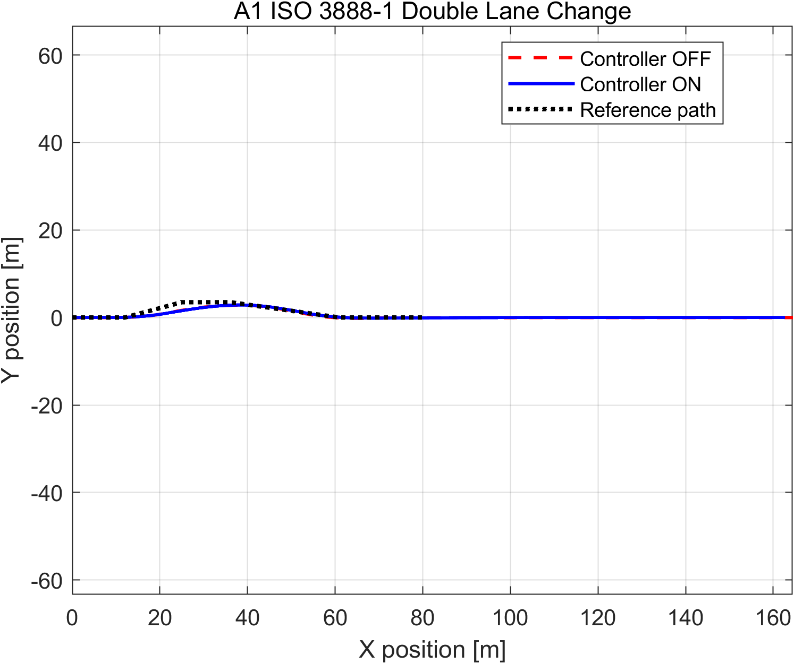

*Figure 4.1 — A1 Controller OFF/ON 및 기준 경로 비교.*

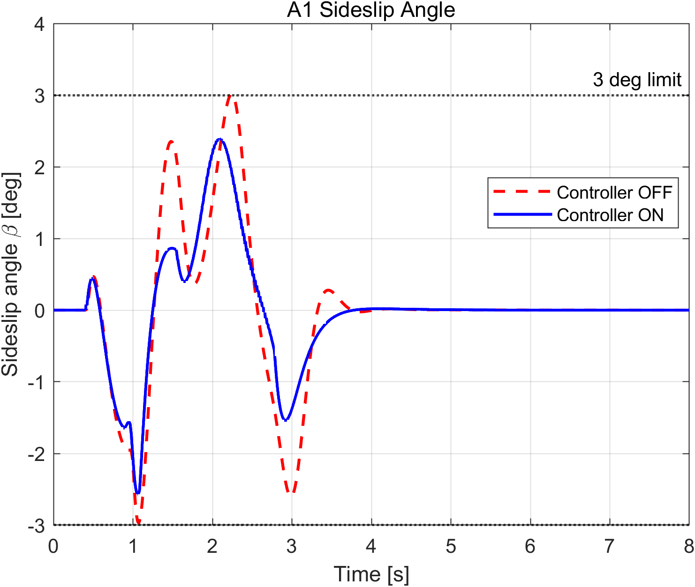

*Figure 4.2 — A1 sideslip angle 비교.*

### 4.4 A3 ISO 7401 Step Steer

A3에서는 PID 기반 AFS가 yaw-rate 과도응답을 크게 개선하였다. Settling time은 1.4620 s에서 0.4630 s로 68.3% 감소했고, overshoot는 2.6997%에서 1.6793%로 감소하였다. Rise time은 0.2470 s에서 0.2600 s로 소폭 증가했지만 수치상 목표 0.3 s 이내였다.

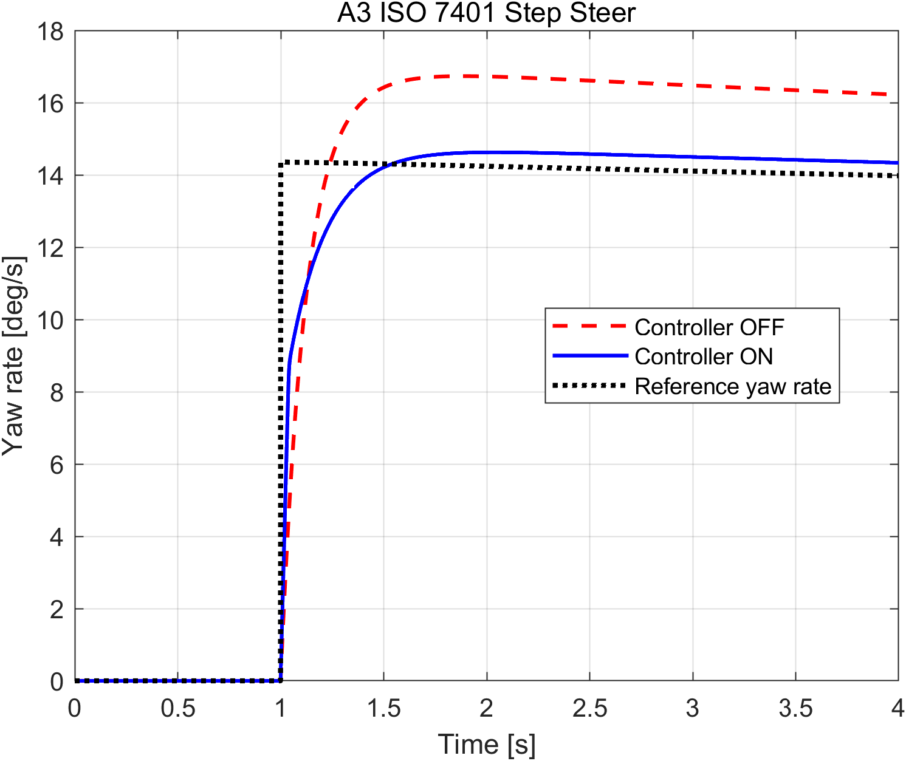

*Figure 4.3 — A3 yaw-rate 응답.*

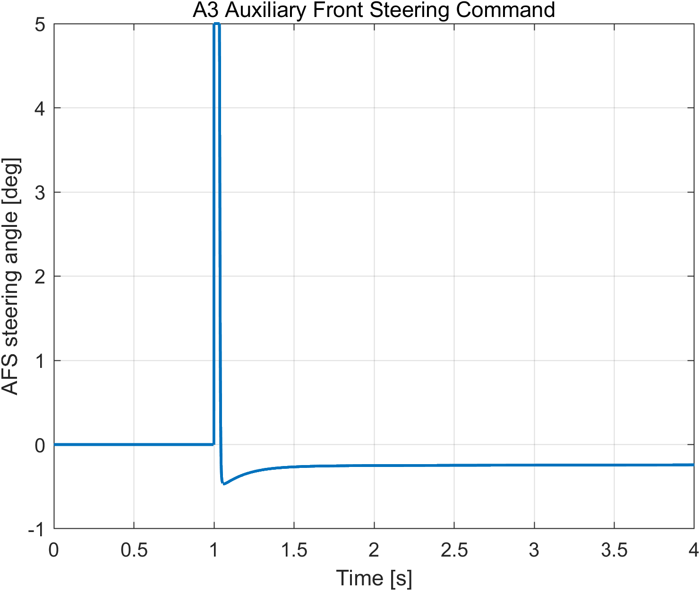

*Figure 4.4 — A3 AFS 보조 조향 명령.*

다만 tireUtilizationMax는 OFF 0.6531에서 ON 0.9996으로 증가하였다. 이는 KPI 응답은 개선되었지만 tire-force 여유가 거의 남지 않았음을 의미한다.

### 4.5 A4 ISO 4138 Steady-State Circular

A4에서 understeer gradient는 0.0007에서 0.0008로 변했고, sideslipMax는 1.1839 deg에서 1.1764 deg로 소폭 감소하였다. 두 항목 모두 자동채점에서 만점을 받았다.

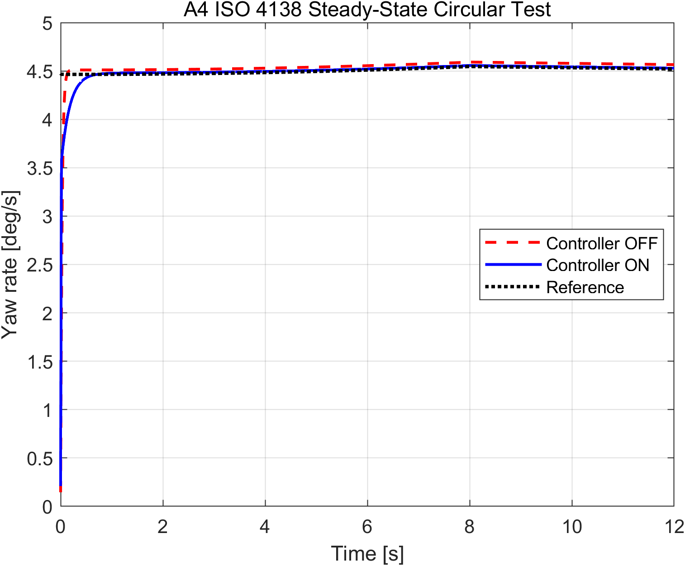

*Figure 4.5 — A4 정상 원선회 yaw-rate 응답.*

### 4.6 A7 ISO 7975 Brake-in-Turn

A7은 본 설계에서 가장 큰 개선을 보였다. Controller OFF에서는 sideSlipMax가 30.4776 deg까지 증가해 spin에 가까운 거동을 보였지만, Controller ON에서는 1.9655 deg로 감소하였다. LTR도 0.6808에서 0.3266으로 감소하였다.

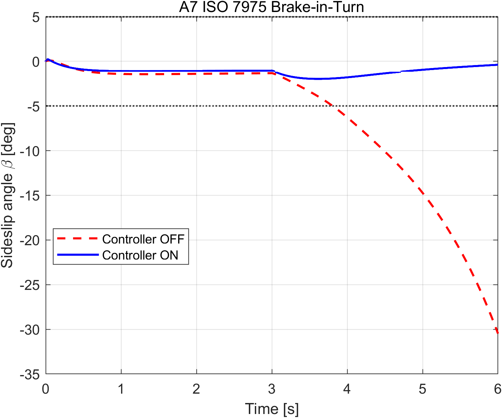

*Figure 4.6 — ESC 적용 전후 A7 sideslip angle 비교.*

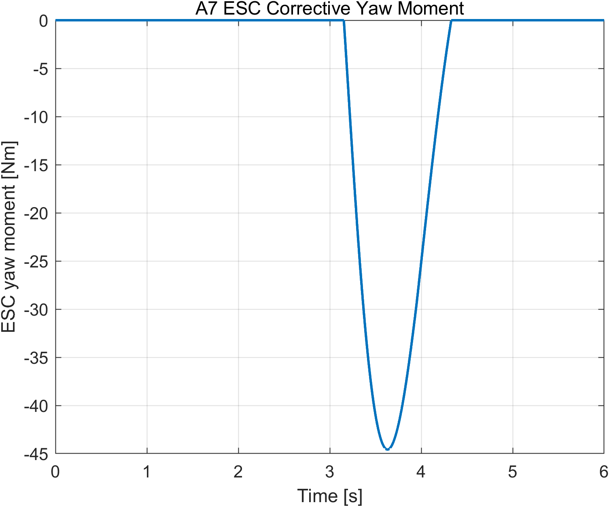

*Figure 4.7 — A7에서 ESC가 발생시킨 보정 yaw moment.*

이 결과는 큰 sideslip 상태에서 sideslip feedback moment가 적극적으로 작동하고, coordinator가 이를 좌우 차동 제동 토크로 배분했기 때문이다. Continuous blending은 정상영역에서 과도한 제동 개입을 줄이면서 위험영역에서는 충분한 ESC 권한을 유지하였다.

### 4.7 B1 ISO 21994 Straight Braking

B1에서 absSlipRMS는 0.7295에서 0.0902로 감소해 목표 0.10을 만족하였다. 반면 stopping distance는 72.2992 m에서 70.2982 m로 2.8%만 감소하여 목표 40 m에는 도달하지 못했다.

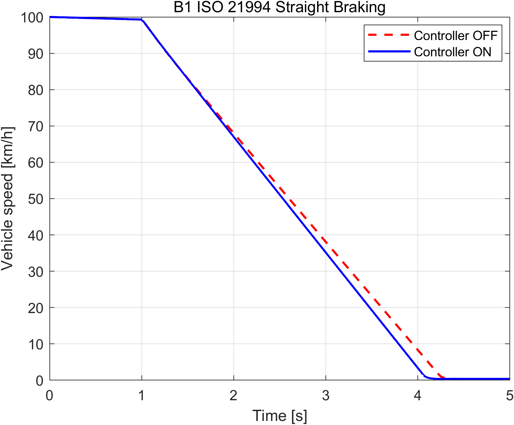

*Figure 4.8 — B1 차량 속도 비교.*

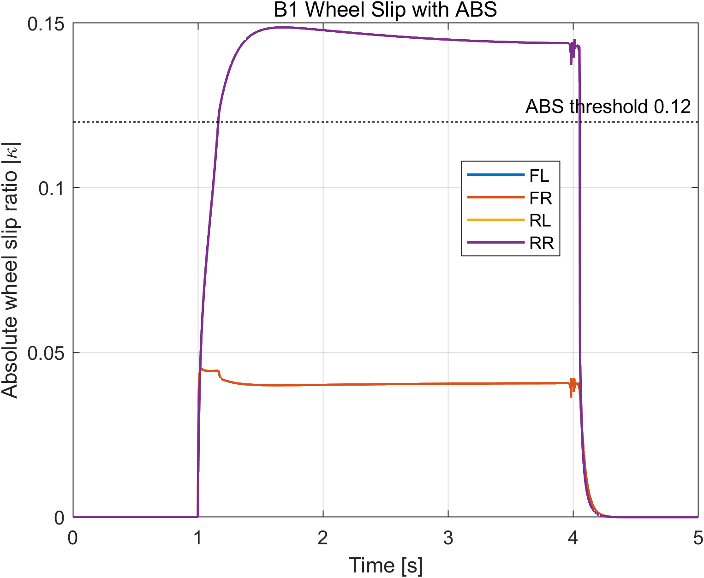

*Figure 4.9 — ABS 작동 시 네 바퀴 slip ratio.*

이는 threshold 기반 brake-release 방식이 wheel lock 억제에는 효과적이지만, 최적 slip을 연속적으로 추종하지 못하고 scenario 기본 brake profile 자체를 재설계하지 못한다는 한계를 보여준다.

### 4.8 D1 DLC + Braking

D1에서는 sideSlipMax가 4.9057 deg에서 3.0585 deg로 감소했으나 LTR과 lateral deviation은 목표를 만족하지 못했다. A1과 동일하게 안정성 향상과 경로 추종 사이의 trade-off가 나타났다.

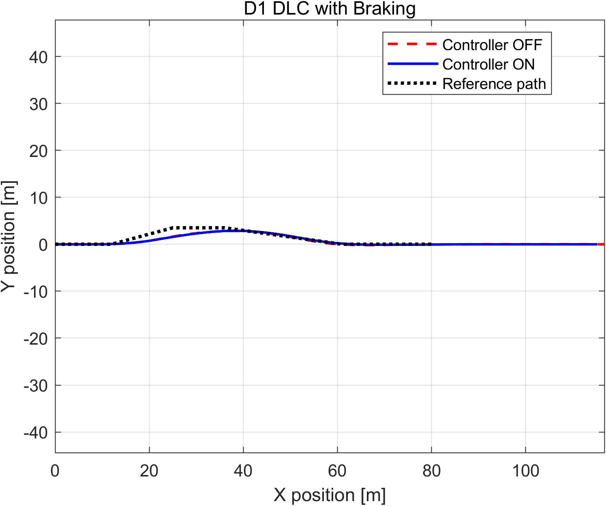

*Figure 4.10 — D1 Controller OFF/ON 및 기준 경로 비교.*

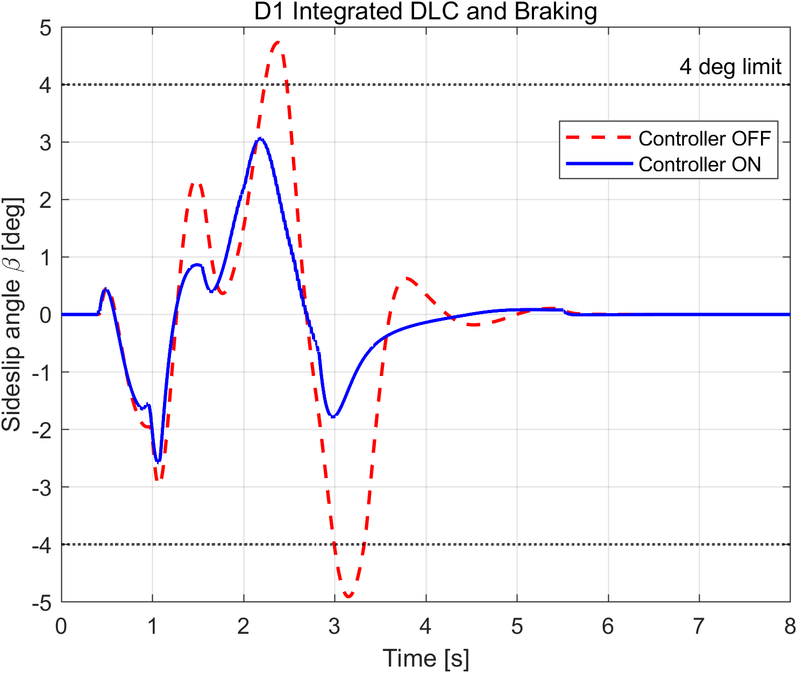

*Figure 4.11 — D1 sideslip angle 비교.*

---

## 5. 분석 및 한계

### 5.1 가장 성공적이었던 시나리오

가장 성공적인 시나리오는 A7 Brake-in-Turn이다. Controller OFF 상태에서 30 deg 이상 발생한 sideslip을 약 2 deg까지 줄였고, LTR 또한 절반 이하로 감소시켰다. 이는 sideslip 기반 ESC가 위험상황을 명확히 식별하고, yaw moment를 좌우 차동 제동으로 변환하는 구조가 유효했기 때문이다. 특히 단순 yaw-rate error 제어만 사용할 경우 driver path를 방해할 수 있지만, sideslip threshold와 blending을 사용함으로써 정상영역과 한계영역을 구분할 수 있었다.

A3도 성공적인 결과를 보였다. 초기 게인에서는 rise time은 빨랐지만 settling time이 길었고 tire usage가 과도하였다. $K_p$와 $K_i$를 낮추고 $K_d$를 높인 뒤 settling time이 기준 이내로 감소하였다. 이는 step-steer response에서 derivative term이 transient damping을 증가시키는 역할을 수행했음을 보여준다.

### 5.2 가장 부족했던 시나리오

가장 부족한 시나리오는 A1과 D1이다. 두 시나리오 모두 sideslip은 개선되었지만 LTR과 lateral deviation 기준을 만족하지 못했다. 주요 원인은 다음과 같다.

1. **Yaw-rate tracking과 path tracking의 차이**  
   `ctrl_lateral`의 입력에는 직접적인 lateral error 또는 heading error가 포함되지 않으며, AFS는 yaw-rate error만 추종한다. 따라서 yaw rate를 잘 추종하더라도 실제 vehicle trajectory의 maximum deviation이 반드시 감소하지는 않는다.

2. **ESC와 경로 추종의 충돌**  
   ESC는 sideslip과 yaw motion을 억제하기 위해 differential braking을 사용한다. 이는 안정성에는 유리하지만, lane-change에서 필요한 순간 yaw response까지 감소시켜 lateral deviation을 증가시킬 수 있다.

3. **명시적인 friction-circle allocation 부재**  
   A1, A3, A4, A7, D1의 tire utilization이 대부분 1에 근접하였다. 현재 coordinator는 단순 split 후 saturation만 수행하므로 steering, longitudinal braking 및 yaw-moment generation이 동일한 tire-force budget을 경쟁하는 현상을 최적으로 처리하지 못한다.

4. **Bicycle model과 14DOF plant 차이**  
   설계에는 roll, pitch, suspension dynamics 및 nonlinear tire saturation을 포함하지 않은 bicycle model을 사용하였다. A1 및 D1에서는 roll load transfer가 크므로 단순 모델에서 얻은 gain이 고차 plant에서 동일하게 작동하지 않는다.

B1에서는 ABS slip 목표는 만족했지만 stopping distance가 충분히 감소하지 않았다. ABS의 목적은 wheel lock을 방지하면서 최대 마찰 영역을 유지하는 것이지만, 현재 구현은 threshold 기반 release logic이므로 최적 slip을 연속적으로 추종하지 않는다. 또한 release 명령만으로 scenario brake command의 전체 profile을 재설계할 수 없다는 구조적 한계가 있다.

### 5.3 개선 방향

추가 시간이 있다면 다음을 적용할 수 있다.

- Bicycle model의 $v_y$, $r$ 상태에 대해 LQR을 설계하고, AFS와 ESC 입력을 동시에 계산하는 MIMO controller를 구성한다.
- Driver/path follower의 lateral error와 heading error를 lateral controller에 전달할 수 있다면, yaw-rate tracking뿐 아니라 path tracking feedback을 추가한다.
- Coordinator에 weighted least squares와 friction-circle constraint를 적용해 tire utilization을 1 이하의 여유 범위로 유지한다.
- ABS를 단순 threshold 방식에서 slip-tracking PI 또는 sliding-mode controller로 확장한다.
- 속도와 노면 마찰계수에 따라 $K_\beta$, $M_{z,max}$ 및 ABS target slip을 scheduling한다.
- C1/C2 시나리오를 사용해 skyhook CDC의 sprung acceleration RMS와 suspension travel 개선 효과를 정량적으로 검증한다.

---

## 6. 참고문헌

[1] ISO 3888-1:2018, *Passenger cars — Test track for a severe lane-change manoeuvre — Part 1: Double lane-change*.

[2] ISO 4138:2021, *Passenger cars — Steady-state circular driving behaviour — Open-loop test methods*.

[3] ISO 7401:2011, *Road vehicles — Lateral transient response test methods — Open-loop test methods*.

[4] ISO 7975:2019, *Passenger cars — Braking in a turn — Open-loop test method*.

[5] ISO 21994:2007, *Passenger cars — Stopping distance at straight-line braking with ABS — Open-loop test method*.

[6] R. Rajamani, *Vehicle Dynamics and Control*, 2nd ed., Springer, 2012.

[7] J. Y. Wong, *Theory of Ground Vehicles*, 4th ed., Wiley, 2008.

[8] D. Hrovat, “Survey of advanced suspension developments and related optimal control applications,” *Automatica*, vol. 33, no. 10, pp. 1781–1817, 1997.

---

## 부록 A — AI 도구 사용 내역

본 프로젝트에서는 ChatGPT를 다음 범위에서 활용하였다.

1. 제공된 repository의 실행 구조와 controller interface 파악
2. PID, ESC β-limiter, ABS 및 skyhook controller의 초기 구조 제안
3. MATLAB benchmark 결과의 KPI 비교와 gain tuning 방향 검토
4. 보고서 초안의 구조화 및 수식 정리

제안된 gain은 그대로 확정하지 않았으며, MATLAB 14DOF benchmark 결과를 반복적으로 확인해 직접 조정하였다. 예를 들어 초기 lateral gain $K_p=0.8$, $K_i=0.08$, $K_d=0.08$에서 A3 settling time이 1.173 s였으나, simulation-based tuning을 통해 $K_p$, $K_i$를 감소시키고 $K_d$를 증가시켜 settling time을 0.5 s 이하로 개선하였다.

`student_info.m`의 `ai_usage` 항목도 본 부록과 동일한 내용으로 작성한다.

---

## 부록 B — sim_params.m 및 주요 controller 변경사항

> 아래 수치는 2026-06-23 18:19:03에 실행한 최종 `grade.m` 결과와 대응하는 설정이다. 이후 controller 또는 gain을 수정하면 본 보고서와 `grade_report.json`을 다시 갱신해야 한다.

```matlab
% Lateral controller
CTRL.LAT.Kp = 0.72;
CTRL.LAT.Ki = 0.04;
CTRL.LAT.Kd = 0.12;
CTRL.LAT.intMax = 0.25;

% Longitudinal controller
CTRL.LON.Kp = 0.4;
CTRL.LON.Ki = 0.03;
CTRL.LON.intMax = 5.0;

% Vertical controller
CTRL.VER.cMin = 700;
CTRL.VER.cMax = 4500;
CTRL.VER.skyGain = 2300;
```

`ctrl_lateral.m`의 추가 설정:

```matlab
Kbeta    = 4.0e4;
Kr       = 4.0e3;
betaTh   = min(deg2rad(3.0), 0.40*LIM.MAX_SLIP_ANGLE);
betaOn   = deg2rad(1.5);
betaFull = deg2rad(3.0);
MzLimit  = 4500;
```

`ctrl_longitudinal.m`의 ABS 설정:

```matlab
kTarget = 0.10;
kHigh   = 0.12;
releaseForce = 2.5e4*(kPeak-kTarget);
```

`ctrl_coordinator.m`의 주요 배분 설정:

```matlab
frontShare = 0.60;
rearShare  = 0.40;
ratioF     = 0.65;  % ESC yaw moment front allocation
```
